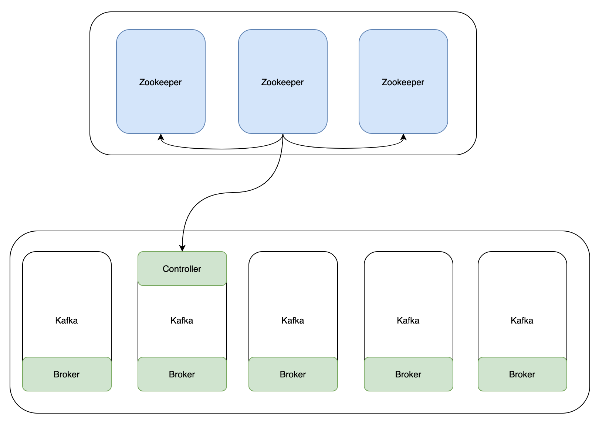
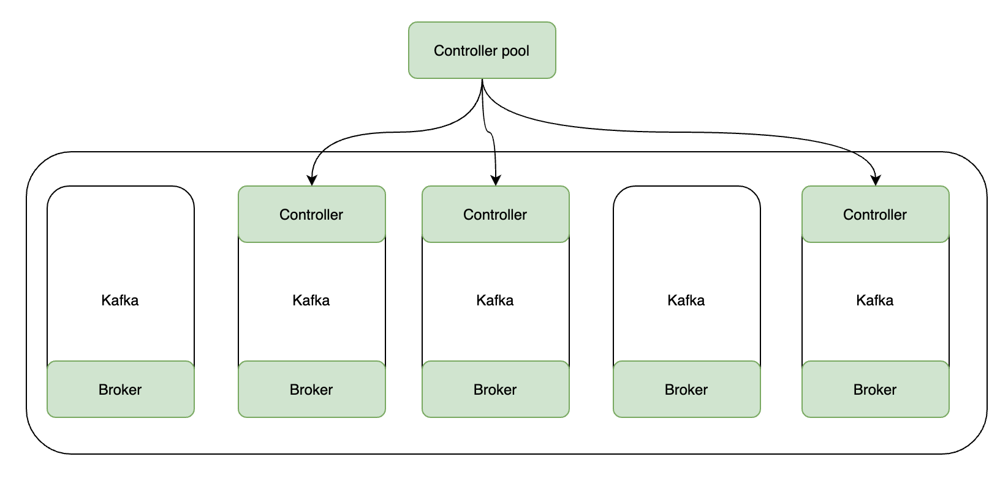
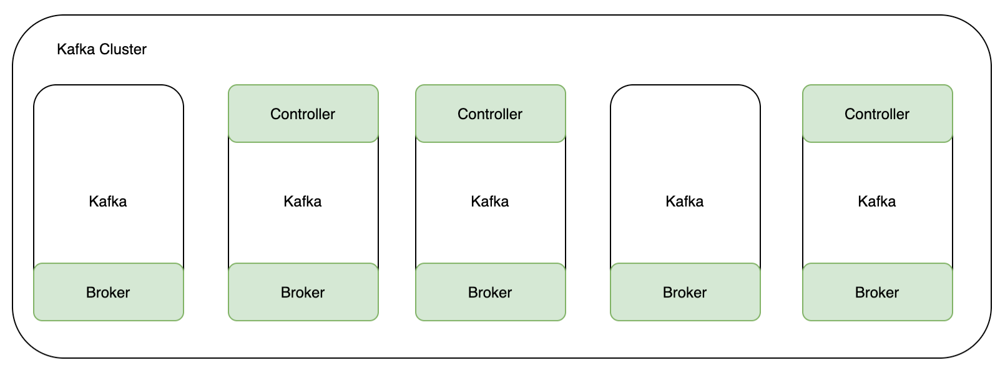

# 为什么去ZK化

在2.x以及之前的版本，Kafka需要依赖Zookeeper来管理整个集群的Metadata，但ZK和Kafka一起使用，本身有以下问题待解决：

1. ZK作为CP模式，每次元数据的更新都是以全量推的方式进行，开销很大。
2. 为了维护Kafka，还需要维护ZK，无形中提升了运维压力。
3. ZK的1MB限制。

于是提出了KIP-500议案，主要思想是“用Kafka来管理Kafka”，元数据直接存储在Kafka中，无需引入外部的Zookeeper，这套模式也被称为KRaft模式。

# KRaft模式

## Role

不管是ZK还是KRaft，1个健康的Kafka集群，都需要依赖[Controller](https://github.com/9029HIME/Kafka_Learn/blob/master/src/mds/04%20KafkaBroker.md)的协调。在ZK模式下，**Controller有且仅有1个**，由Broker抢先向ZK注册决定，谁先注册，谁就是Controller，这个过程我们无法直接设定：

**而KRaft模式下，Controller可以有多个**，多个Controller可以看成多个ZK节点。可以通过Broker的配置文件来确定这个Broker的角色，具体由配置属性Process.Roles确定：

1. Process.Roles = Broker, 服务器在 KRaft 模式中充当 Broker。
2. Process.Roles = Controller, 服务器在 KRaft 模式下充当 Controller。
3. Process.Roles = Broker,Controller，服务器在 KRaft 模式中同时充当 Broker 和 Controller。
4. 如果 process.roles 没有设置。那么集群就假定是运行在 ZooKeeper 模式下。

**这一点和[Elasticsearch的节点类型](https://github.com/9029HIME/es/blob/master/2022-ES-Relearn/04-%E8%8A%82%E7%82%B9%E7%B1%BB%E5%9E%8B.md)有点类似，在资源充足的情况下，1个Broker对应1个Role是有必要的。**

## Quorum

只配置Role不能直接决定Controller是谁，想成为Controller的Broker还需要配置到controller.quorum.voters里。并且Controller之间也有Leader和Follower之分。

如果从Controller的角度看，属性有3类：

1. Leader

   整个 Kafka 集群的主节点，由具有 controller 角色并在`controller.quorum.voters` 配置的列表中的节点担任，负责维护元数据的读写。

2. Follower(Voter)

   有投票权的从节点，由具有 controller 角色并在`controller.quorum.voters` 配置的列表中的节点担任，从 Leader 节点处同步集群元数据，并负责处理部分来自 Follower(Observer)的集群元数据读请求

3. Follower(Observer)

   没有投票权的从节点，从 `Leader/Follower(Voter)` 处同步元数据，包含以下两类节点：

   1. 只具有 broker 角色的节点，需注意 broker 角色功能模块将通过监听集群元数据变化来进行对应创建分区等动作，负责消息数据的读写
   2. 具有 controller 角色但不在 `controller.quorum.voters` 列表中的节点。

**也就是说，在KRaft模式下，Broker采用Fetch的方式，从Leader和Voter定期拉取最新的元数据。Voter也通过Fetch的方式，从Leader定期拉取最新的元数据。**